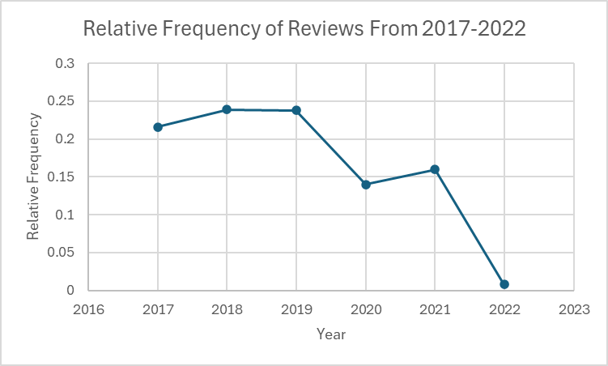
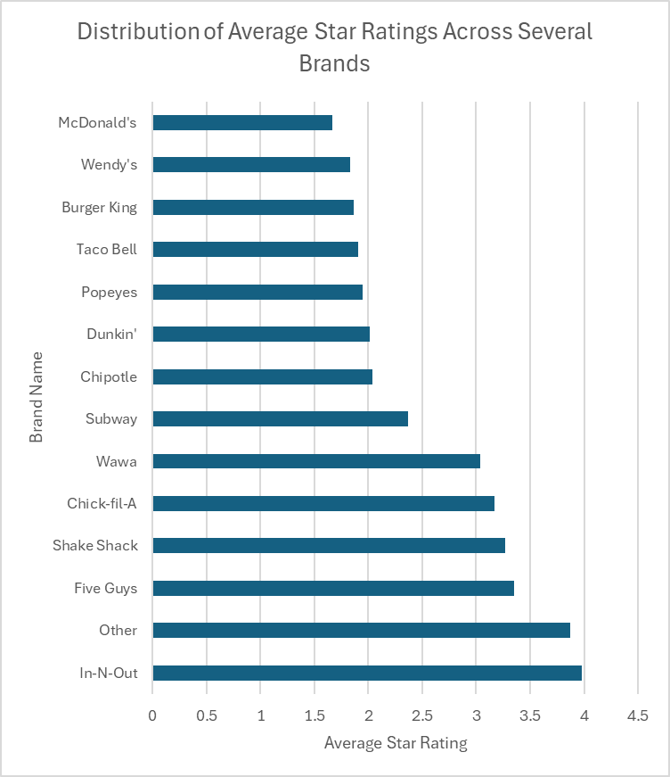
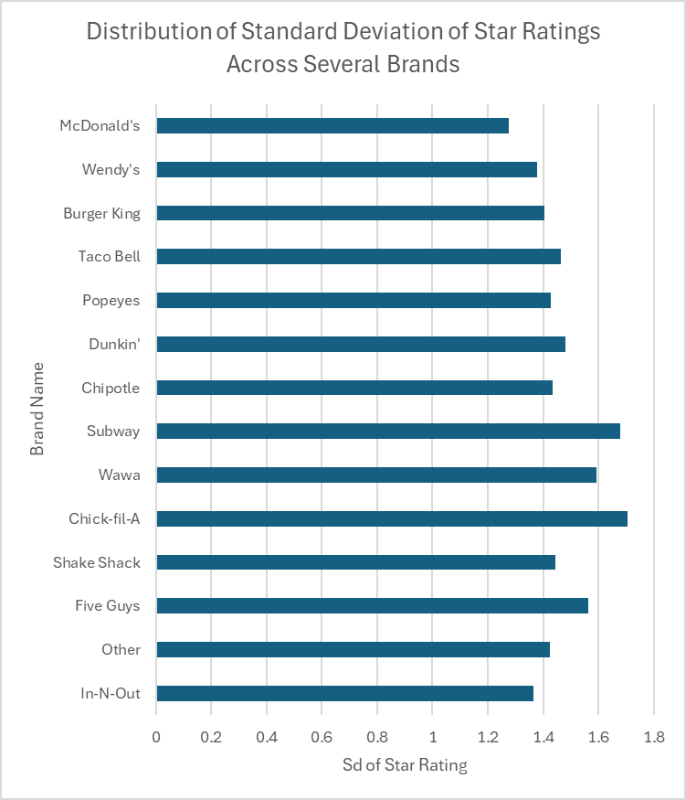
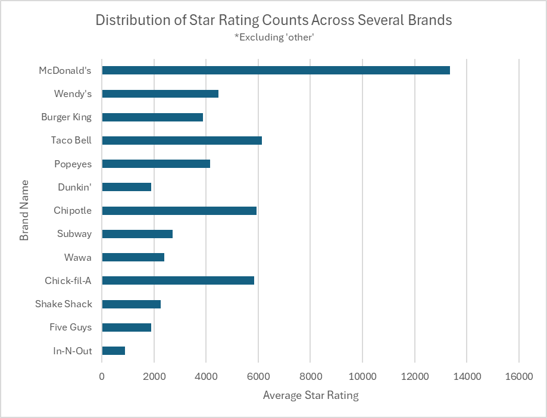

# Descriptive Analysis Interpretation

## Objective
Establish a baseline understanding of customer satisfaction,
review volume trends, and brand-level performance across
quick-service restaurants.

## Rating Distribution
Nearly half of all reviews are 5-star, indicating a strong
left skew. There is the least amount of 2 and 3-star reviews, totalling to less than one-fifth of the data. 
.png>)

**Interpretation:** People are more prone to leave a review when they have stronger opinions, hence the small proportions of 2 and 3-star reviews, which is a possible indicator of non-response bias.

## Review Volume Over Time
Review activity peaked between 2017–2019 before declining
during 2020. Post-2020 recovery appears uneven across years.

**Interpretation:** The decline in 2019-2020 most likely is due to Covid-19, which is important to keep in mind for analysis.

## Brand-Level Ratings
While average star ratings across major QSR brands are mostly
similar, variability in review counts and standard deviation
suggests differences in consistency and customer experience.

**Interpretation:** Brands with high variance may suffer from
location-level operational inconsistency, warranting deeper
investigation.