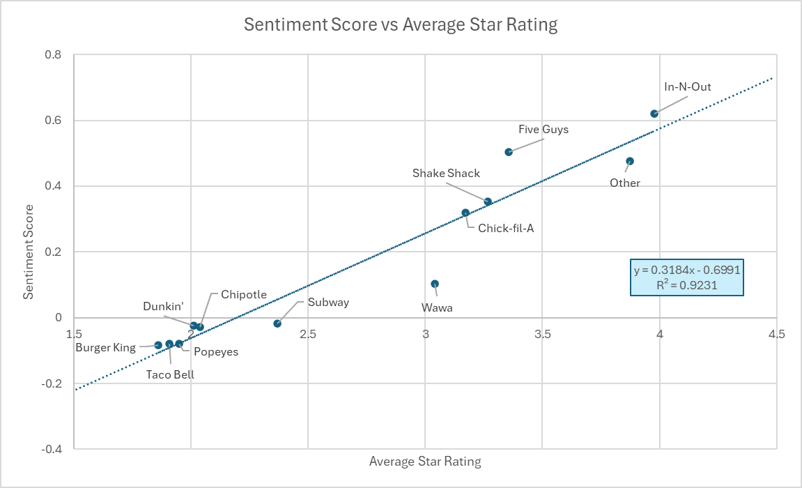
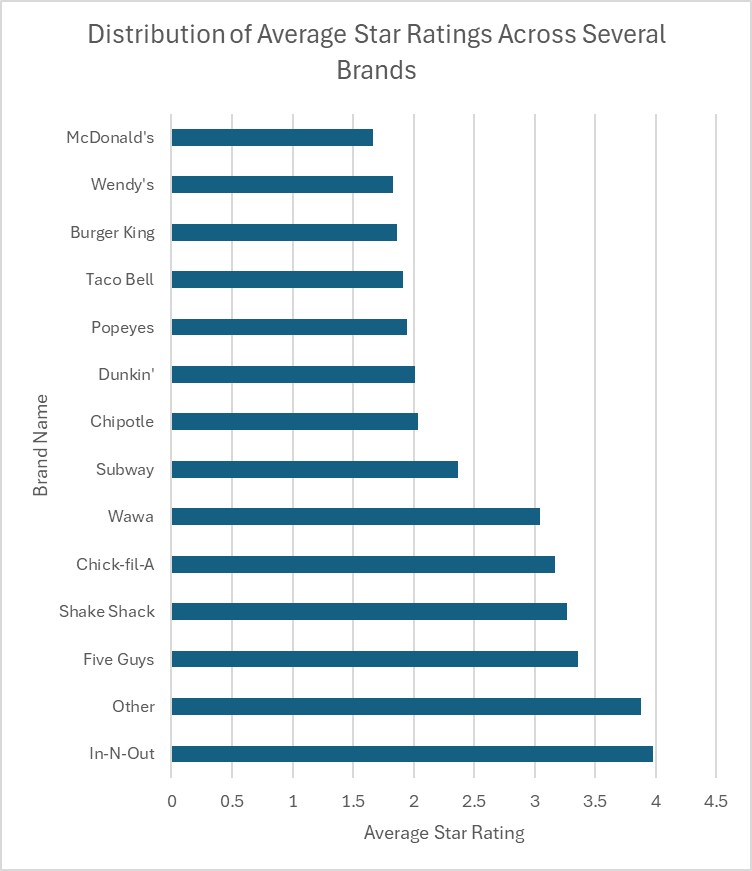
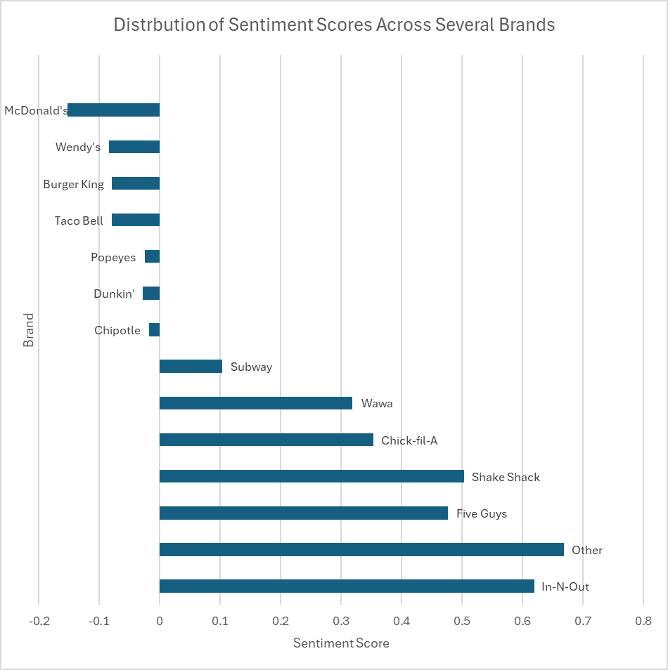
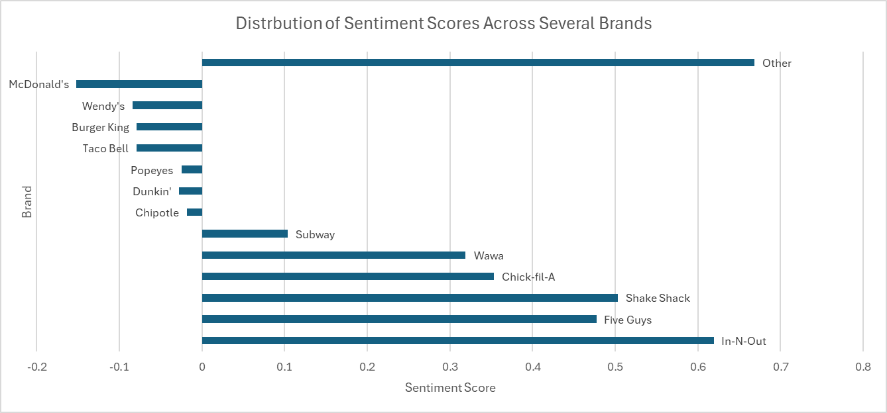

# Sentiment Analysis Interpretation

## Objective
Quantify the emotional tone of customer reviews and evaluate
how sentiment aligns with star ratings and brand-level outputs.

## Sentiment vs Star Ratings
While sentiment and ratings are highly correlated (r = 0.96), they scale differently: neutral sentiment (0.0) occurs at a low 2.2-star rating, suggesting customers use polite language even when dissatisfied. A "Politeness Gap" appears in mid-tier brands like Shake Shack, where positive sentiment outpaces the numerical rating. Ultimately, star ratings measure utility and disappointment, while sentiment captures emotional connection and brand enthusiasm.

  
  

## Brand-Level Sentiment Interpretations
Volume vs. Quality:
- McDonald's holds the highest volume (13,348 reviews) but the lowest sentiment and rating scores. This reflects a "Large-Scale Service" trend: high-speed, high-volume operations often correlate with more frequent complaints. In contrast, In-N-Out has a smaller sample size (887) but significantly higher loyalty, indicating a strategy that prioritizes quality and consistency over market saturation.

Chipotle’s Sentiment Crisis:
- Despite its "premium" fast-casual positioning, Chipotle’s negative sentiment (-0.018) and low 2.04-star rating align it with budget brands like Dunkin' and Popeyes. This decline suggests significant issues with service consistency or price-to-value perception.

The Strength of "Other" Brands:
- The "Other" category (representing local or smaller chains) outperforms nearly all major brands except In-N-Out. This indicates that consumers are generally more satisfied with specialized, local options than they are with the "Big 10" national chains.

Sentiment vs. Stars Variance:
- Star ratings show high standard deviation (1.3 - 1.7), revealing polarized opinions (many 1-star and 5-star reviews). Conversely, sentiment scores have a tighter standard deviation (0.5 - 0.7). This suggests that while ratings are extreme, the actual language used in reviews is more moderate.

## Business Implications
- Monitor sentiment alongside star ratings
- Identify recurring negative themes for improvement
- Use sentiment shifts as potential indicators of declining
  customer experience