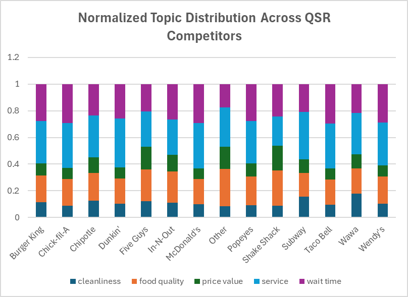
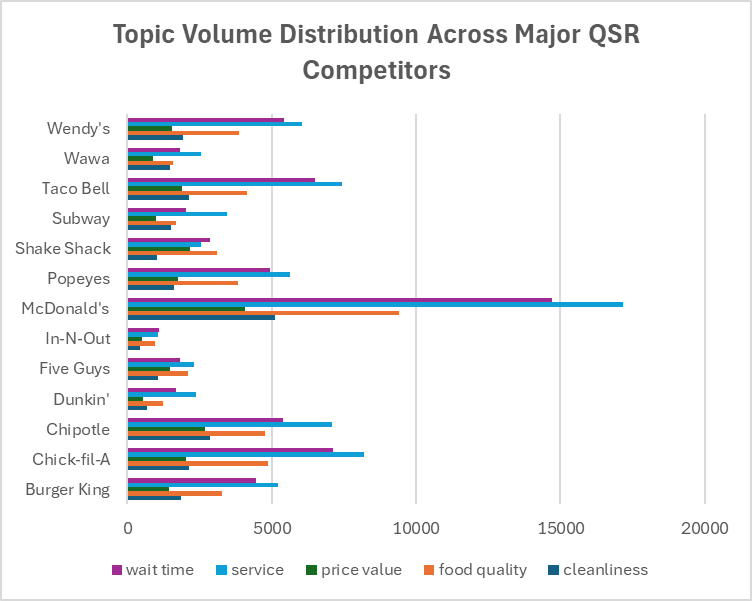
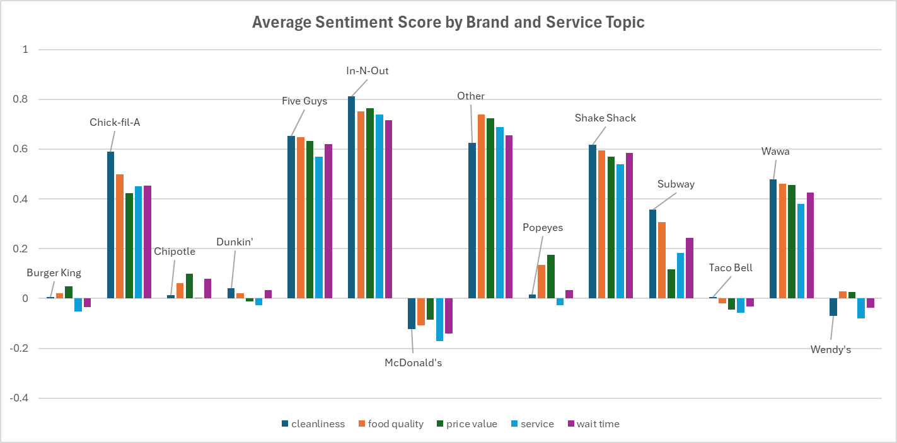

# Business Recommendations

## Normalized Topic Distribution Across QSR Competitors

- The market is split between transaction brands, businesses where the customers' primary goals are speed and utility, (Dunkin', McDonald's), where ~65% of the conversation is stuck on Service/Wait Time, and experience brands (Five Guys, Shake Shack, In-N-Out), typically have ~40% of the customer's attention toward Food Quality and Price Value. 

## Topic Volume Distribution Across Major QSR Competitors

- This dataset measures customer feedback volume across five topics, revealing that McDonald’s dominates the market with engagement levels more than double any other brand, peaking at 17,169 service mentions. Across the board, Service and Food Quality are the main causes of consumer reviews, as seen in Chick-fil-A’s high service count (8,197) compared to its lower price value mentions (2,039). Smaller-footprint brands like In-N-Out show much lower feedback density, while specialized chains like Shake Shack demonstrate a strong focus on product over environment, with 3,113 food quality mentions nearly tripling its cleanliness score.

## Average Sentiment Score by Brand and Service Topic

- This table represents the average sentiment score distribution for each brand across five categories, where positive values indicate customer satisfaction and negative values indicate dissatisfaction. In-N-Out is the sentiment leader, maintaining the highest scores across all categories, including a peak of 0.811 for cleanliness. In contrast, McDonald’s has consistent negative sentiment, underperforming in every metric with its lowest score in service (-0.172). Premium-tier brands like Five Guys and Shake Shack show consistently strong sentiment (all scores >0.53), whereas legacy fast-food giants like Burger King and Taco Bell hover near neutral, with Taco Bell notably struggling in service sentiment (-0.057).

## Summary of Findings
Analysis of 6M+ Yelp reviews across major QSR brands shows that
the QSR market has an inverse relationship between volume and sentiment, with McDonald’s greatest amount of volume despite negative customer sentiment across all categories. Experience brands like In-N-Out and Five Guys have lower feedback volume but achieve higher satisfaction, with In-N-Out leading in sentiment. The market divides between transaction brands, focusing on speed and utility (65% of dialogue on service/wait time), and experience brands, focusing customer attention on food quality and price value (~40%).

## Key Problems Identified
1. The Engagement-Reputation Gap: The brands with the highest market visibility and engagement are suffering from the worst reputations. McDonald’s leads the industry in feedback volume but is the only brand to maintain negative sentiment scores across every single metric, particularly in service (-0.172).
2. Speed-Value Friction: High-utility brands like Dunkin’ and McDonald’s are trapped in a cycle where ~65% of customer reviews is based on service and wait times, suggesting that these chains are failing to meet the "speed and utility" expectations that define their business model.
3. Service Sentiment Drag: Even for legacy brands with neutral food quality sentiment, service remains a major liability. Taco Bell and Burger King struggle with negative service sentiment (-0.057 and -0.051 respectively), indicating that poor customer interactions are actively dragging down their overall brand perception despite acceptable product quality.

## Recommended Actions
- Prioritize Service for High-Volume Chains: Large-scale transactional brands must fix their service protocols to improve negative sentiment. McDonald’s should prioritize its Service (-0.172) and Wait Time (-0.140) metrics, as these are the primary drivers of its brand-wide dissatisfaction.
- Leverage Food Quality: Legacy brands with near-neutral sentiment should change marketing to highlight product quality instead of only talking about value and prices. Burger King and Wendy’s should capitalize on their positive Food Quality sentiment (0.021 and 0.030) to make up for the negative service reviews.
- Transactional Brands: Transactional brands like Dunkin’ must reduce the "utility friction" by shifting customer focus away from Service/Wait Time (~65% of reviews). Implementing technology that can improve service and waiting time could move them closer to the "Experience" model seen in Five Guys, where a more balanced focus on Food Quality (0.648) leads to significantly higher overall satisfaction.
- Expirience Brands: High-sentiment leaders like In-N-Out should keep doing what they are doing to prove that they are worth the hype and price. With a peak Cleanliness score of 0.811, they should continue using facility excellence as a competitive moat against lower-tier competitors who are still in the neutral or negative territory.

## Metrics to Track
- Weekly sentiment score by brand/location
- Share of reviews mentioning wait time or service issues
- How likely a customer is to stop buying from us because of how bad the service is